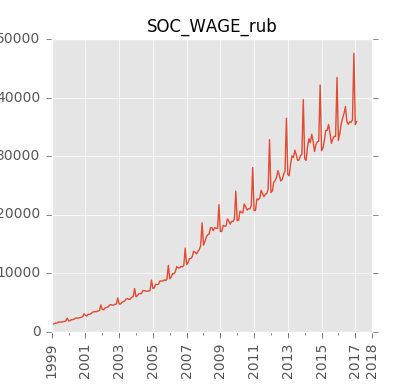

##Краткосрочные экономические показатели Российской Федерации  

Исходная публикация на сайте Росстата: [www.gks.ru][gks-stei]

Ряды данных:
- в формате Excel: [kep.xlsx][kep-at-git-xlsx], [kep.xls][kep-at-git-xls]
- в формате csv:
  - [годовые](https://raw.githubusercontent.com/epogrebnyak/rosstat-kep-data/master/output/data_annual.txt)
  - [квартальные](https://raw.githubusercontent.com/epogrebnyak/rosstat-kep-data/master/output/data_qtr.txt)
  - [месячные](https://raw.githubusercontent.com/epogrebnyak/rosstat-kep-data/master/output/data_monthly.txt)

- [список переменных](https://raw.githubusercontent.com/epogrebnyak/rosstat-kep-data/master/output/varnames.md)

Графики:
- [PDF](https://github.com/epogrebnyak/rosstat-kep-data/blob/master/output/monthly.pdf)
- [*.png](https://github.com/epogrebnyak/rosstat-kep-data/blob/master/output/images.md)

[kep-at-git-xlsx]: https://github.com/epogrebnyak/rosstat-kep-data/blob/master/output/kep.xlsx?raw=true
[kep-at-git-xls]: https://github.com/epogrebnyak/rosstat-kep-data/blob/master/output/kep.xls?raw=true
[gks-stei]: http://www.gks.ru/wps/wcm/connect/rosstat_main/rosstat/ru/statistics/publications/catalog/doc_1140080765391

## Примеры работы с программой 
- Получение данных: [example_use_data.py](example_use_data.py)
- Импорт в базу данных: [example_import.py](example_import.py)

## Основные показатели

##Итоговое использование
1. Ряды со снятием сезонности
2. Переменная состояния среды (фильтр Калмана по 3-5 переменным)
3. Индекс промышленного производства через натуральные показатели
4. Индекс инвестиций через инвестицонные товары 
5. Описание недостающих переменных и блоков (экспортные цены на нефть, например)
6. Простая структурная модель с одновременными уравнениями (ВВП по компонентам, нефть, простой платежный баланс)
