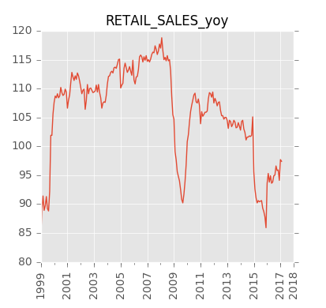

## Краткосрочные экономические показатели Российской Федерации (временные ряды) 

### Основные показатели





Оглавление и список переменных:
- [оглавление](https://raw.githubusercontent.com/epogrebnyak/rosstat-kep-data/master/data/2015/ind12/toc.txt) 
- [список переменных](https://github.com/epogrebnyak/data-rosstat-kep/blob/master/output/varnames.md)

Ряды данных:
- в формате Excel: [kep.xlsx][kep-at-git-xlsx], [kep.xls][kep-at-git-xls]
- в формате csv:
  - [годовые](https://raw.githubusercontent.com/epogrebnyak/rosstat-kep-data/master/output/data_annual.txt)
  - [квартальные](https://raw.githubusercontent.com/epogrebnyak/rosstat-kep-data/master/output/data_qtr.txt)
  - [месячные](https://raw.githubusercontent.com/epogrebnyak/rosstat-kep-data/master/output/data_monthly.txt)

Графики:
- [PDF](https://github.com/epogrebnyak/rosstat-kep-data/blob/master/output/monthly.pdf)
- [*.png](https://github.com/epogrebnyak/rosstat-kep-data/blob/master/output/images.md)

Исходная публикация на сайте Росстата: [www.gks.ru][gks-stei]

[kep-at-git-xlsx]: https://github.com/epogrebnyak/rosstat-kep-data/blob/master/output/kep.xlsx?raw=true
[kep-at-git-xls]: https://github.com/epogrebnyak/rosstat-kep-data/blob/master/output/kep.xls?raw=true
[gks-stei]: http://www.gks.ru/wps/wcm/connect/rosstat_main/rosstat/ru/statistics/publications/catalog/doc_1140080765391


## Как использовать эти данные 

### Excel

Вы можете скачать файлы в формате Excel и выбрать в столбцах необходимые ряды данных.  

### Python 

Для работы с датафреймами pandas данные могут импортироваться из CSV файлов с небольшим преобразованием типа дат. Скрипт ниже загружает данные через интернет:

```python
import pandas as pd

URL_DIR = "https://raw.githubusercontent.com/epogrebnyak/rosstat-kep-data/master/output/"
dfa = pd.read_csv(URL_DIR  + "data_annual.txt", index_col = 0)
dfm = pd.read_csv(URL_DIR  + "data_monthly.txt", converters = {'time_index':pd.to_datetime}, 
                                                 index_col = 'time_index')
dfq = pd.read_csv(URL_DIR  + "data_quarter.txt", converters = {'time_index':pd.to_datetime}, 
                                                 index_col = 'time_index')
```
 
После этого временные ряды доступны в датафреймах ```dfa```, ```dfq``` и ```dfm```, например:

```
>>> print(dfa.GDP_yoy)
year
1999    106.4
2000    110.0
2001    105.1
2002    104.7
2003    107.3
2004    107.2
2005    106.4
2006    108.2
2007    108.5
2008    105.2
2009     92.2
2010    104.5
2011    104.3
2012    103.5
2013    101.3
2014    100.7
2015     96.3
Name: GDP_yoy, dtype: float64
```

Код импорта данных содержится в файле [interface.py](interface.py)

### R

Пример импорта данных в R: [interface.r](interface.r)

## Как обновить данные

- Cкачать и распаковать последний обзор с [сайта Росстата][gks-stei] в папку [data](https://github.com/epogrebnyak/data-rosstat-kep/tree/master/data)
- Запустить [kep.word2csv.word](https://github.com/epogrebnyak/data-rosstat-kep/blob/master/kep/word2csv/word.py). Будет выполнено:
```python
from kep.config import CURRENT_MONTH_DATA_FOLDER
folder_to_csv(CURRENT_MONTH_DATA_FOLDER)
```

- Запустить [update_kep.py](https://github.com/epogrebnyak/data-rosstat-kep/blob/move_specs_2/update_kep.py). Будет выполнено:
```python
from kep import KEP

k = KEP().update()
dfa, dfq, dfm = k.get_all()
k = k.write_xl()
k.write_monthly_pdf()
k.write_monthly_png()
```
