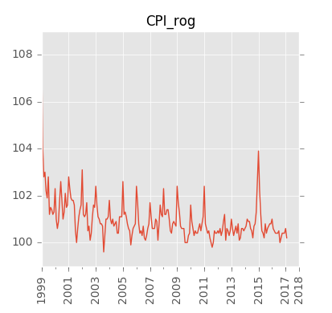

##Краткосрочные экономические показатели Российской Федерации  

Исходная публикация на сайте Росстата: [www.gks.ru][gks-stei]

Ряды данных:
- в формате Excel: [kep.xlsx][kep-at-git-xlsx], [kep.xls][kep-at-git-xls]
- в формате csv:
  - [годовые](https://raw.githubusercontent.com/epogrebnyak/rosstat-kep-data/master/output/data_annual.txt)
  - [квартальные](https://raw.githubusercontent.com/epogrebnyak/rosstat-kep-data/master/output/data_qtr.txt)
  - [месячные](https://raw.githubusercontent.com/epogrebnyak/rosstat-kep-data/master/output/data_monthly.txt)

- [список переменных](https://raw.githubusercontent.com/epogrebnyak/rosstat-kep-data/master/output/varnames.md)

Графики:
- [PDF](https://github.com/epogrebnyak/rosstat-kep-data/blob/master/output/monthly.pdf)
- [*.png](https://github.com/epogrebnyak/rosstat-kep-data/blob/master/output/images.md)

[kep-at-git-xlsx]: https://github.com/epogrebnyak/rosstat-kep-data/blob/master/output/kep.xlsx?raw=true
[kep-at-git-xls]: https://github.com/epogrebnyak/rosstat-kep-data/blob/master/output/kep.xls?raw=true
[gks-stei]: http://www.gks.ru/wps/wcm/connect/rosstat_main/rosstat/ru/statistics/publications/catalog/doc_1140080765391

## Примеры работы с программой 
- Получение данных: [example_use_data.py](example_use_data.py)
- Импорт в базу данных: [example_import.py](example_import.py)

## Основные показатели




# Development (разработка)

## Структура программы (program flow)
```
1. Converter
doc - > raw csv
(word.py)

2. Parser
raw csv + specification -> labelled csv -> flat stream -> database
         (load_spec.py)   (label_csv.py)  (stream.py)    (database.py)

3. Selector
database -> dfm, dfq, dfa -> get_ts(), get_df()
                      ... -> get_varnames()   
(query.py)

4. Plotting
(plot.py)
```

##Comments
---------
17:26 15.12.2015

** \(G2\) make full coverage of KEP publication + brush dataset **

After
- sections: group by section + add section headers in output
- change some tests - not imported must be zero

Main:
- extend specification 

For that:
- make_headers() diagnostics to check how many variables are there all in all
- add more definitions to specification
- add "PROFIT" segment
- solve 'fake' variable (_OVERDUE) - add segment
- see what variables need new format of readers
  
---------
13:04 07.12.2015

- datasets to be used in R and Excel for further analysis/modelling
- at git:
  (G0) maintainable/readable code + data structures + package structure + documentation + testing
  (G1) enhance graphs 
  (G2) make full coverage of KEP publication + brush dataset (describe which variables of purposefully not imported)
  (G3) make friendly API and usage example, no duplication of main calls (kill main? kill temp?) 
  (G4) cleaner data export  
  (G5) data transformation (seasonality/detrending wth HP, index time series)
  (G6) fix what is not todo / low priority
- propose key features for online interactive shell for KEP, similar to FRED

(G0) maintainable/readable code + data structure
- decide on packages (convert,parse,store + read/select + plot) or flat structure 

(G1) enhance graphs 
- no rigged upper end on png plots
- extend x axis to end of current year 
- add text name to graph title

(G2) make full coverage of KEP publication + brush dataset
- import October 2015 data

(G3) make friendly API with examples

(G4) clean data export  
- add NA to CSV/Excel export
- indicate which variables are a, q or m in 'variables sheet'

(G5) data transformation (seasonality/detrending wth HP, index time series)
- add seasonal component for selected variables (output monthly_nsa, monthly_sa, monthly_trend)
- add trend component for selected variables (output monthly_nsa, monthly_sa, monthly_trend)
- dating resession: data structure and background picture

##Todo

Самое важное сейчас:
- [ ] issue #31: Testing: make test_1.py executable with py.test

Экспорт данных
- [ ] issue  #1 - экспорт данных: улучшение форматирования xls(x) файлов / apearance of xlsx file

Парсинг и импорт 
- [ ] issue #34: make varlist, including segments
- [ ] make varlist in order of appearance in markupfile + include segments

Тестирование
- [ ] issue #31 - запустить py.test внутри пакета (вместе c __init__.py) - Testing: run test_1.py executable with py.test 

Текущие ошибки парсинга 
- [ ] #14: https://github.com/epogrebnyak/rosstat-kep-data/issues/14 'CORP_DEBT_rog' is invalid data (ind06)
- [ ] #35: не читается переменная 'PROFIT'

Рисунки:
- [ ] issue #33: Plotting: all single .png plots in plots.py lack proper dates on x axis

Докуменатция:
- [ ] issue #25: улучшить скрипт построения документации
- [ ] issue #32: написать примеры использвоания API - write API examples for README.md

##Done
Парсинг и импорт 
- [x] issue #30 - прочитать данные из csv c иcпользованием нескольких файлов разметки - read raw csv using config file and two spec files 

Экспорт данных
- [x] issue #24 - экспорт данных: xls файл
- [x] issue #26 - упрощение формата csv, use native pandas export for csv files

Рисунки:
- [x] issue #29: Save all monthly plots as .png files 
- [x] issue #27: make full list of .png files as markdown file 

##Not todo

Новые функции
- [ ] таблицы с нестандартным количеством столбцов, импорт данных по ВВП
- [ ] разбивка png-md или pdf файла на разделы
- [ ] новый шаблон pdf файла
- [ ] sql dump of database

Некритические
- [ ] transfer useful functions from old_src at src branch
- [ ] генерировать tab_headers.txt - использовать make_headers(p) в label_csv из ветки old_src
- [ ] issue #20: integrity check of database
- [ ] may remove first 'readers functions' part in spec file
- [ ] issue #6: orderly sequence of variables in xlsx file - in columns
- [ ] groups/sections of variables in pdf/md-png
- [ ] rename common to io + move load_spec to common + make test_load_spec.py
- [ ] check if header (eg "Объем платных услуг населению") has multiple appearances in raw csv file 
- [ ] issue #36: substitute 'tabulate' module with simple pure python function to write table
- [ ] maybe move 'output' folder to root  


##Итоговое использование
1. Ряды со снятием сезонности
2. Переменная состояния среды (фильтр Калмана по 3-5 переменным)
3. Индекс промышленного производства через натуральные показатели
4. Индекс инвестиций через инвестицонные товары 
5. Описание недостающих переменных и блоков (экспортные цены на нефть, например)
6. Простая структурная модель с одновременными уравнениями (ВВП по компонентам, нефть, простой платежный баланс)