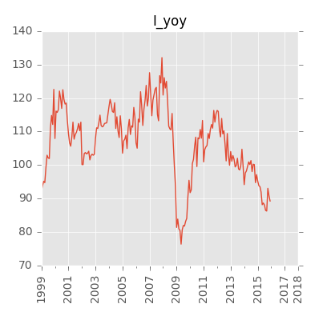
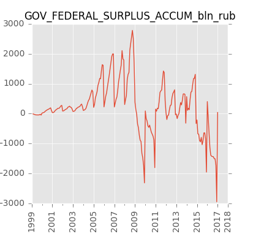
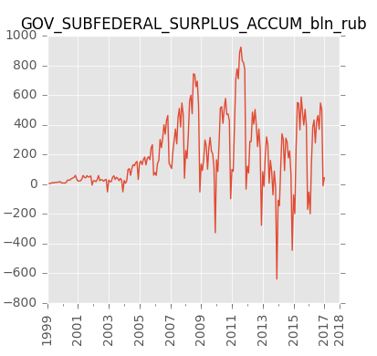

##Краткосрочные экономические показатели Российской Федерации  

Исходная публикация на сайте Росстата: [www.gks.ru][gks-stei]

Оглавление и список переменных:
- [оглавление](https://raw.githubusercontent.com/epogrebnyak/rosstat-kep-data/master/data/2015/ind12/toc.txt) 
- [список переменных](https://raw.githubusercontent.com/epogrebnyak/rosstat-kep-data/master/output/varnames.md)

Ряды данных:
- в формате Excel: [kep.xlsx][kep-at-git-xlsx], [kep.xls][kep-at-git-xls]
- в формате csv:
  - [годовые](https://raw.githubusercontent.com/epogrebnyak/rosstat-kep-data/master/output/data_annual.txt)
  - [квартальные](https://raw.githubusercontent.com/epogrebnyak/rosstat-kep-data/master/output/data_qtr.txt)
  - [месячные](https://raw.githubusercontent.com/epogrebnyak/rosstat-kep-data/master/output/data_monthly.txt)

Графики:
- [PDF](https://github.com/epogrebnyak/rosstat-kep-data/blob/master/output/monthly.pdf)
- [*.png](https://github.com/epogrebnyak/rosstat-kep-data/blob/master/output/images.md)

[kep-at-git-xlsx]: https://github.com/epogrebnyak/rosstat-kep-data/blob/master/output/kep.xlsx?raw=true
[kep-at-git-xls]: https://github.com/epogrebnyak/rosstat-kep-data/blob/master/output/kep.xls?raw=true
[gks-stei]: http://www.gks.ru/wps/wcm/connect/rosstat_main/rosstat/ru/statistics/publications/catalog/doc_1140080765391

## Примеры импорта данных 

Получение рядов данных в виде датафреймов pandas или R показано в файлах [interface_pandas.py][interface_pandas.py] и 
[interface.r][interface.r]. 

## Основные показатели

